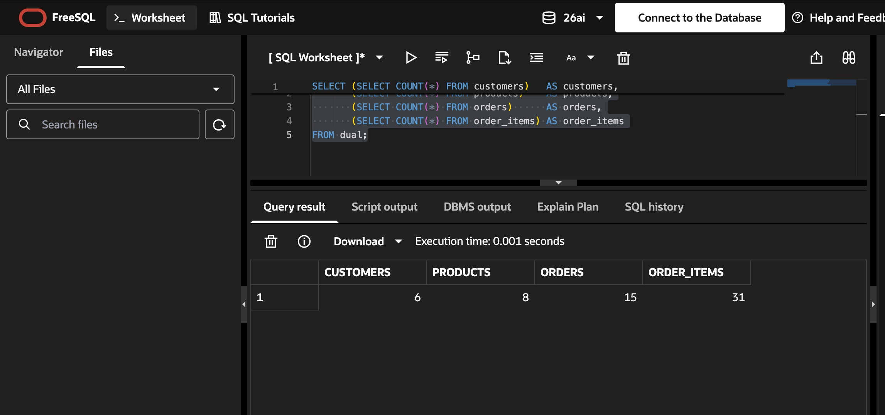
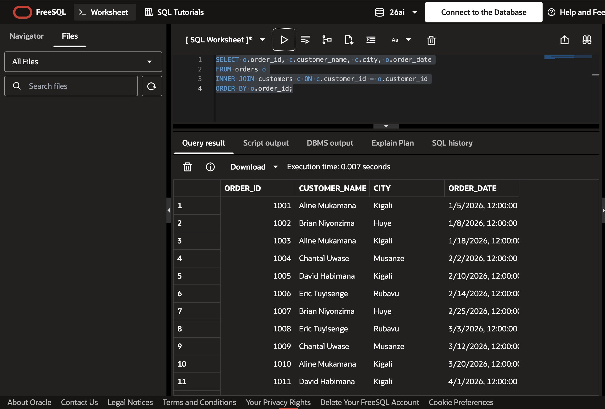
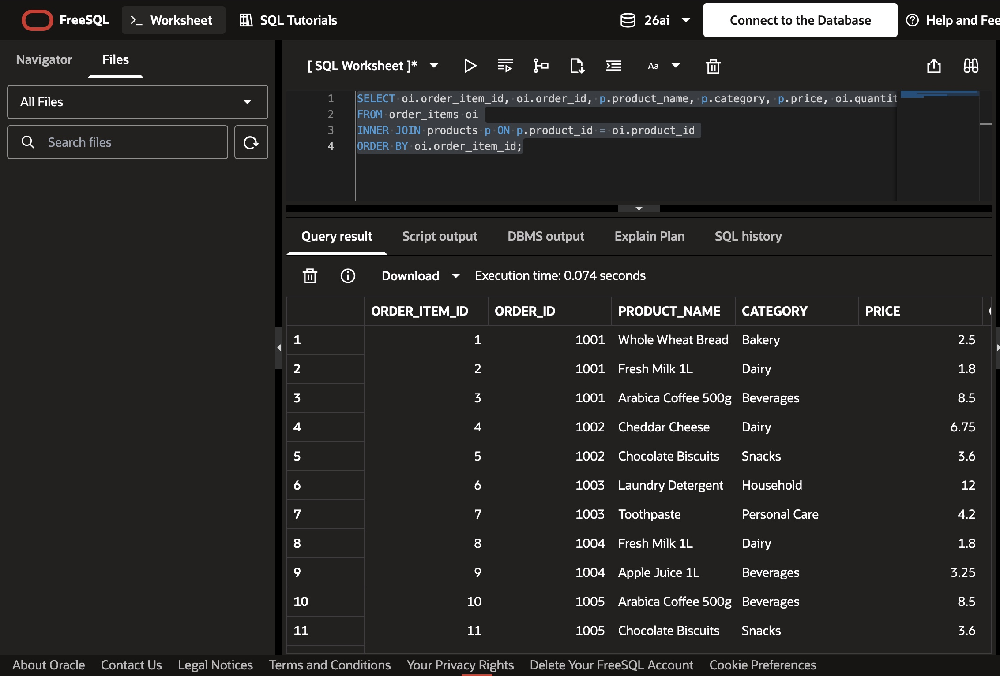
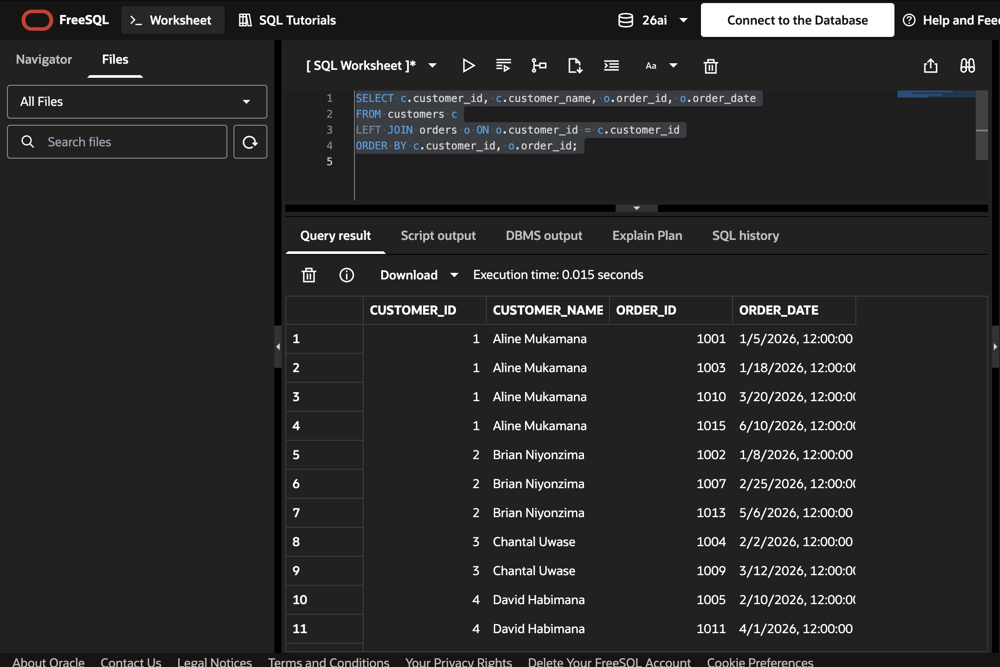
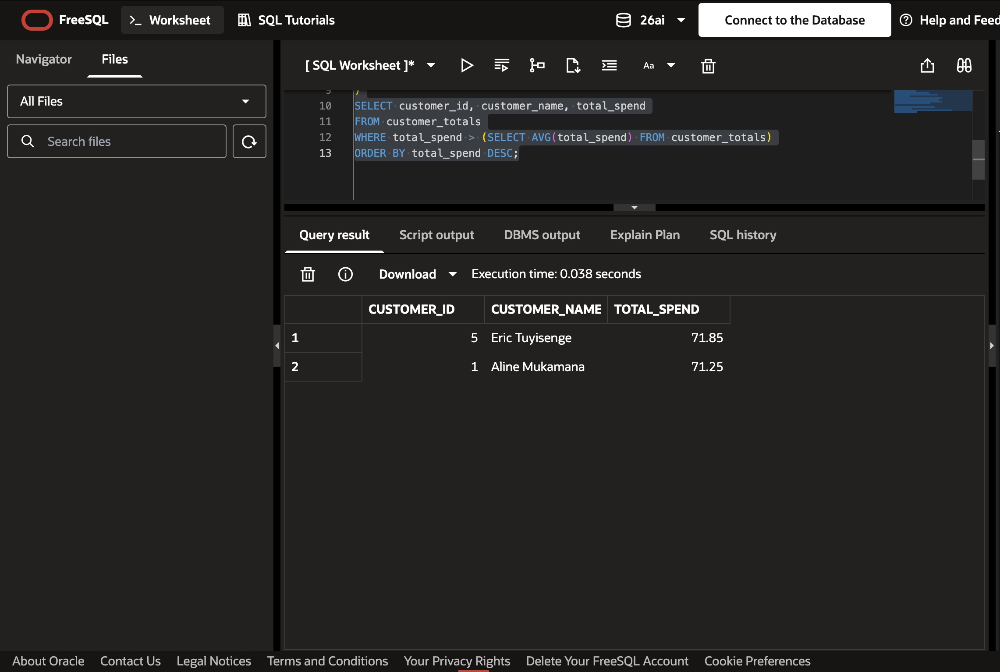
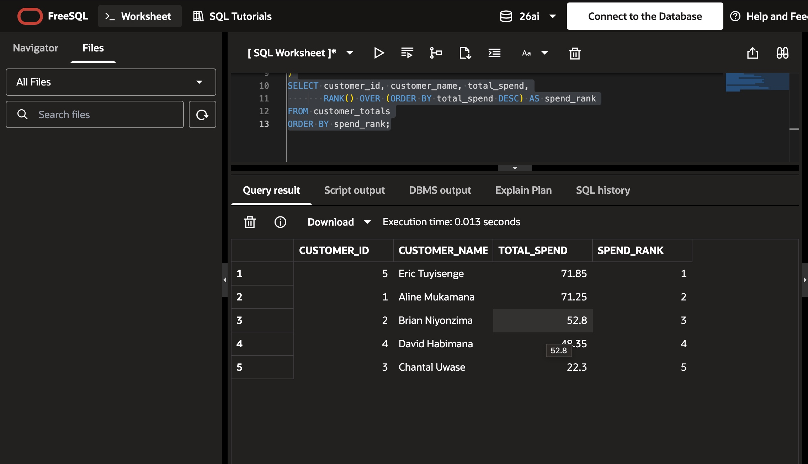
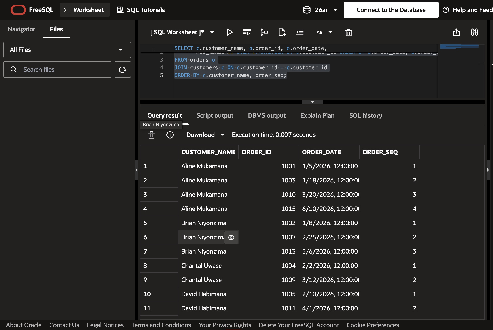
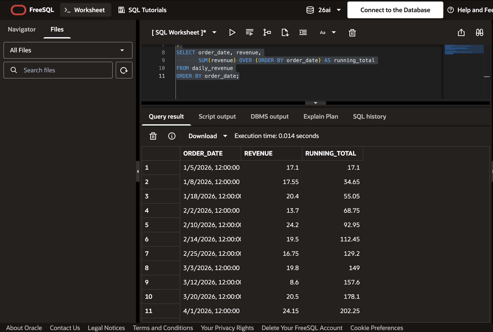
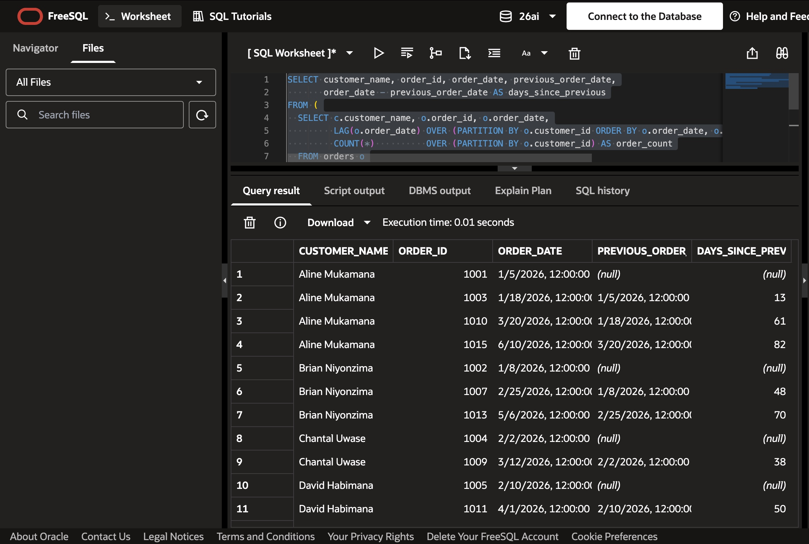

# Sunrise Supermarket - PL/SQL Assignment One

| | |
|---|---|
| **Student name** | Ineza RUTAYISIRE Merveille |
| **Student ID** | 29066 |
| **Repository** | `assignment_1_ineza-rutayisire-merveille-29066` |
| **DBMS used** | Oracle AI Database 26ai, run online in **Oracle FreeSQL** (freesql.com) |
| **Due date** | 21 September 2026, 23:59 |

## 1. Summary of what I did

I designed and populated a four-table Oracle database for Sunrise Supermarket (`customers`, `products`, `orders`, `order_items`) and wrote the analysis queries management asked for:

- **3 JOIN queries**: an INNER JOIN of orders and customers, an INNER JOIN of order items and products, and a LEFT JOIN of customers and orders.
- **1 CTE query**: total spend per customer, and the customers whose spend is above average.
- **4 window-function queries**: `RANK()`, `ROW_NUMBER()`, a running total with `SUM() OVER`, and `LAG()` for days between orders.
- **1 validation query**: row counts that prove the data meets the minimum requirements.

Every query was run in Oracle FreeSQL, and the screenshot of each result is included below, followed by a business interpretation.

## 2. Business scenario

Sunrise Supermarket sells products to customers. Customers place orders, and each order contains one or more items. Management wants to understand **who the customers are, what they buy, and how sales are trending over time**. The value of an order line is always `quantity x price`, so revenue questions join `order_items` to `products`.

## 3. Repository contents

- `schema_and_data.sql` - creates the four tables and inserts the sample data
- `analysis_queries.sql` - all JOIN, CTE and window-function queries plus the count validation query (these are the exact queries shown in the screenshots)
- `screenshots/` - one screenshot per query result from Oracle FreeSQL
- `README.md` - this report

## 4. How to run

1. Open **freesql.com**, start the SQL Worksheet and connect to the database.
2. Run `schema_and_data.sql` **once**. It creates the tables, inserts the data and commits.
3. Run each query in `analysis_queries.sql` one at a time and compare with the screenshots below.
4. If the tables already exist from an earlier run, drop them in child-to-parent order before rerunning:

```sql
DROP TABLE order_items CASCADE CONSTRAINTS;
DROP TABLE orders CASCADE CONSTRAINTS;
DROP TABLE products CASCADE CONSTRAINTS;
DROP TABLE customers CASCADE CONSTRAINTS;
```

## 5. Data coverage

| Requirement | Minimum | Data loaded |
|---|---:|---:|
| Customers | 5 | **6** |
| Products | 8 | **8** |
| Product categories | 3 | **6** (Bakery, Dairy, Beverages, Snacks, Household, Personal Care) |
| Orders | 15 | **15** |
| Order items | 25 | **31** |
| Order dates | multiple | January to June 2026 |

One customer, Fiona Ingabire, has no orders on purpose, so the LEFT JOIN visibly shows a customer with no matching order.

### Validation: row counts

```sql
SELECT (SELECT COUNT(*) FROM customers)   AS customers,
       (SELECT COUNT(*) FROM products)    AS products,
       (SELECT COUNT(*) FROM orders)      AS orders,
       (SELECT COUNT(*) FROM order_items) AS order_items
FROM dual;
```



**Result:** 6 customers, 8 products, 15 orders and 31 order items, so the data meets every minimum in the assignment.

---

## 6. JOIN queries

### JOIN 1 - Every order with the customer's name, city and order date (INNER JOIN)

```sql
SELECT o.order_id, c.customer_name, c.city, o.order_date
FROM orders o
INNER JOIN customers c ON c.customer_id = o.customer_id
ORDER BY o.order_id;
```

**Explanation:** An INNER JOIN of `orders` and `customers` on `customer_id` returns only rows that match on both sides. Every order has a valid customer (enforced by the foreign key), so each order appears exactly once with the customer's name, city and date.



**What the result shows:** Orders 1001 onward, placed between 5 January 2026 and later dates, by customers in Kigali, Huye, Musanze and Rubavu. FreeSQL displays the dates with a `12:00:00` time part because an Oracle `DATE` also stores a time.

**Business interpretation:** Management can see where orders come from. Kigali customers (Aline Mukamana and David Habimana) place the largest share of orders, while Huye, Musanze and Rubavu each contribute fewer. This can guide delivery planning and city-specific promotions.

### JOIN 2 - Every order item with product name, category, price and quantity

```sql
SELECT oi.order_item_id, oi.order_id, p.product_name, p.category, p.price, oi.quantity
FROM order_items oi
INNER JOIN products p ON p.product_id = oi.product_id
ORDER BY oi.order_item_id;
```

**Explanation:** An INNER JOIN of `order_items` and `products` on `product_id` turns each order line into something readable: the product, its category, its unit price and the quantity bought. This is the base for any spend calculation (`quantity x price`).



**What the result shows:** Order 1001, for example, contains Whole Wheat Bread (Bakery, 2.50), Fresh Milk 1L (Dairy, 1.80) and Arabica Coffee 500g (Beverages, 8.50), so one basket spans three categories. Fresh Milk appears on orders 1001 and 1004, Arabica Coffee on 1001 and 1005, and Chocolate Biscuits on 1002 and 1005.

**Business interpretation:** Customers mix everyday low-price staples (milk 1.80, bread 2.50) with higher-priced items (Laundry Detergent 12.00, Arabica Coffee 8.50, Cheddar Cheese 6.75). Repeated products such as milk, coffee and biscuits are the best candidates for stock priority and bundle offers.

### JOIN 3 - All customers and their orders, including customers with no orders (LEFT JOIN)

```sql
SELECT c.customer_id, c.customer_name, o.order_id, o.order_date
FROM customers c
LEFT JOIN orders o ON o.customer_id = c.customer_id
ORDER BY c.customer_id, o.order_id;
```

**Explanation:** A LEFT JOIN starts from `customers` (the left table) and keeps every customer, adding order columns where a match exists. A customer with no orders is still listed, with `NULL` in `ORDER_ID` and `ORDER_DATE`. An INNER JOIN would have removed that customer.



**What the result shows:** Aline Mukamana has four orders (1001, 1003, 1010, 1015), Brian Niyonzima three (1002, 1007, 1013), Chantal Uwase two (1004, 1009), and David Habimana appears with 1005 and 1011 among his orders. Fiona Ingabire, the customer with no orders, appears at the end of the result with `NULL` order fields.

**Business interpretation:** A registered customer who has never ordered is a lost opportunity. This query identifies them so they can receive a welcome offer or a re-engagement message.

---

## 7. CTE query

### Customers whose total spend is above the average customer spend

```sql
WITH customer_totals AS (
  SELECT c.customer_id, c.customer_name,
         SUM(oi.quantity * p.price) AS total_spend
  FROM customers c
  JOIN orders o       ON o.customer_id = c.customer_id
  JOIN order_items oi ON oi.order_id   = o.order_id
  JOIN products p     ON p.product_id  = oi.product_id
  GROUP BY c.customer_id, c.customer_name
)
SELECT customer_id, customer_name, total_spend
FROM customer_totals
WHERE total_spend > (SELECT AVG(total_spend) FROM customer_totals)
ORDER BY total_spend DESC;
```

**Explanation:** The CTE `customer_totals` runs first and computes each customer's total spend, `SUM(quantity x price)`, by joining customers, orders, order items and products. The main query then compares each total with `AVG(total_spend)` taken from the same CTE. The average is calculated over customers who have bought something (5 customers), so it is 266.55 / 5 = **53.31**.



| customer_id | customer_name | total_spend |
|---:|---|---:|
| 5 | Eric Tuyisenge | 71.85 |
| 1 | Aline Mukamana | 71.25 |

**Business interpretation:** Only two customers spend more than the 53.31 average: Eric Tuyisenge and Aline Mukamana. These are the high-value customers who deserve loyalty rewards or VIP treatment. Brian Niyonzima (52.80) misses the threshold by only 0.51, so a small nudge could move him into the high-value group.

---

## 8. Window-function queries

### Window 1 - Rank customers by total amount spent

```sql
WITH customer_totals AS (
  SELECT c.customer_id, c.customer_name,
         SUM(oi.quantity * p.price) AS total_spend
  FROM customers c
  JOIN orders o       ON o.customer_id = c.customer_id
  JOIN order_items oi ON oi.order_id   = o.order_id
  JOIN products p     ON p.product_id  = oi.product_id
  GROUP BY c.customer_id, c.customer_name
)
SELECT customer_id, customer_name, total_spend,
       RANK() OVER (ORDER BY total_spend DESC) AS spend_rank
FROM customer_totals
ORDER BY spend_rank;
```

**Explanation:** The same customer totals are calculated in a CTE, then `RANK() OVER (ORDER BY total_spend DESC)` gives rank 1 to the highest spender. `RANK()` keeps ties visible and leaves a gap after them (there are no ties in this data).



| customer_id | customer_name | total_spend | spend_rank |
|---:|---|---:|---:|
| 5 | Eric Tuyisenge | 71.85 | 1 |
| 1 | Aline Mukamana | 71.25 | 2 |
| 2 | Brian Niyonzima | 52.80 | 3 |
| 4 | David Habimana | 48.35 | 4 |
| 3 | Chantal Uwase | 22.30 | 5 |

**Business interpretation:** Total revenue from buying customers is 266.55. The top two customers contribute 143.10 (about 54%), and the top three about 73.5%, so revenue is concentrated in a small group. Eric and Aline are only 0.60 apart, a very close race for first place. Chantal Uwase, in last place, spends less than a third of the leader.

### Window 2 - Number each customer's orders in the order they were placed

```sql
SELECT c.customer_name, o.order_id, o.order_date,
       ROW_NUMBER() OVER (PARTITION BY o.customer_id ORDER BY o.order_date, o.order_id) AS order_seq
FROM orders o
JOIN customers c ON c.customer_id = o.customer_id
ORDER BY c.customer_name, order_seq;
```

**Explanation:** `ROW_NUMBER() OVER (PARTITION BY customer_id ORDER BY order_date, order_id)` restarts at 1 for every customer and counts their orders chronologically. `order_id` is a tie-breaker so the numbering is always the same.



**What the result shows:** Aline Mukamana's orders are numbered 1 to 4 (1001, 1003, 1010, 1015), Brian Niyonzima's 1 to 3, Chantal Uwase's 1 to 2, and David Habimana's start at 1 (1005) and 2 (1011).

**Business interpretation:** The sequence number separates first-time purchases from repeat purchases. Aline is the most frequent shopper with four orders, while customers stuck at order 1 or 2 are candidates for loyalty incentives.

### Window 3 - Running total of revenue over time

```sql
-- Revenue is summed per day first so two orders on the same date do not give an unstable running total.
WITH daily_revenue AS (
  SELECT o.order_date, SUM(oi.quantity * p.price) AS revenue
  FROM orders o
  JOIN order_items oi ON oi.order_id  = o.order_id
  JOIN products p     ON p.product_id = oi.product_id
  GROUP BY o.order_date
)
SELECT order_date, revenue,
       SUM(revenue) OVER (ORDER BY order_date) AS running_total
FROM daily_revenue
ORDER BY order_date;
```

**Explanation:** Revenue is first summed per day in the CTE `daily_revenue`, then `SUM(revenue) OVER (ORDER BY order_date)` accumulates it. Summing per day first avoids unstable results when two orders share the same date.



**What the result shows:** Revenue accumulates from 17.10 on 5 January to 34.65 on 8 January, 112.45 by 14 February and 202.25 by 1 April 2026. The final row reaches 266.55, which equals the sum of all customer totals in the ranking above.

**Business interpretation:** Sales grow steadily with no long flat periods. With 266.55 of revenue over 15 orders, the average order is about 17.77. Management can use this curve to track progress against monthly revenue targets.

### Window 4 - Days between a customer's current and previous order

```sql
SELECT customer_name, order_id, order_date, previous_order_date,
       order_date - previous_order_date AS days_since_previous
FROM (
  SELECT c.customer_name, o.order_id, o.order_date,
         LAG(o.order_date) OVER (PARTITION BY o.customer_id ORDER BY o.order_date, o.order_id) AS previous_order_date,
         COUNT(*)          OVER (PARTITION BY o.customer_id) AS order_count
  FROM orders o
  JOIN customers c ON c.customer_id = o.customer_id
)
WHERE order_count > 1
ORDER BY customer_name, order_date, order_id;
```

**Explanation:** `LAG(order_date)` looks back to the previous order within each customer (`PARTITION BY customer_id`). Subtracting dates in Oracle returns the number of days. Window functions cannot be used in `WHERE`, so the calculation sits in an inline view, and `COUNT(*) OVER (PARTITION BY customer_id)` lets the outer query keep only customers with more than one order. A customer's first order has no previous order, so its gap is `NULL`.



| customer | order | days since previous order |
|---|---:|---:|
| Aline Mukamana | 1003 | 13 |
| Aline Mukamana | 1010 | 61 |
| Aline Mukamana | 1015 | 82 |
| Brian Niyonzima | 1007 | 48 |
| Brian Niyonzima | 1013 | 70 |
| Chantal Uwase | 1009 | 38 |
| David Habimana | 1011 | 50 |

**Business interpretation:** The gaps between orders are getting longer for our best repeat customers: Aline went from 13 days to 61 and then 82, and Brian from 48 to 70. That is an early warning of customers drifting away. A reminder or targeted offer around 30 to 45 days after an order could bring them back sooner.

---

## 9. Overall business interpretation

- **Who the customers are:** Six customers across four cities, with Kigali producing the most orders.
- **What they buy:** Baskets combine everyday staples (milk, bread, biscuits) with higher-value items (coffee, cheese, detergent) across six product categories.
- **Customer value:** Revenue is concentrated: Eric Tuyisenge and Aline Mukamana are the only customers above the 53.31 average, and the top three customers generate about 73% of the 266.55 total.
- **Trend over time:** Cumulative revenue grows steadily across January to June 2026.
- **Recommended actions:** reward the two high-value customers, nudge Brian Niyonzima above the average, send reminders when repeat customers pass about 40 days without an order, and run a welcome offer for Fiona Ingabire, who has never ordered.

## 10. Challenges and resolutions

| Challenge | Resolution |
|---|---|
| I did not have Oracle installed locally | Used **Oracle FreeSQL** (freesql.com), a free browser-based Oracle 26ai database, and took screenshots from its Query result grid |
| Running the data script twice caused `ORA-00001: unique constraint violated` on `ORDER_ITEMS` | The first run had already inserted the rows. I checked the counts, and where needed dropped the tables (child tables first) and ran the script once |
| GitHub rejected my first repository name ("Couldn't check availability") | The name contained spaces. I used underscores and a hyphen: `assignment_1_ineza-rutayisire-merveille-29066` |
| Order value is not stored, only quantity and price in separate tables | Joined `order_items` to `products` and calculated `quantity * price` |
| Window functions cannot be used in `WHERE` (needed for "customers with more than one order") | Calculated `COUNT(*) OVER (...)` in an inline view and filtered in the outer query |
| Two orders on the same date make a running total ambiguous | Summed revenue per day in a CTE before applying `SUM() OVER` |
| "Above average" depends on who is included in the average | The average is calculated over customers who have bought something (53.31); customers with no orders are excluded and shown separately by the LEFT JOIN |
| FreeSQL shows dates with a `12:00:00` time part | Oracle `DATE` stores a time; all times are identical, so date subtraction still returns whole days |
